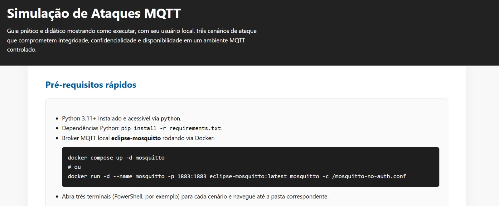
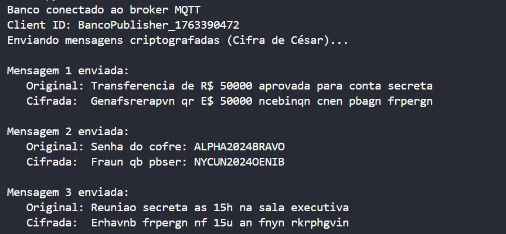
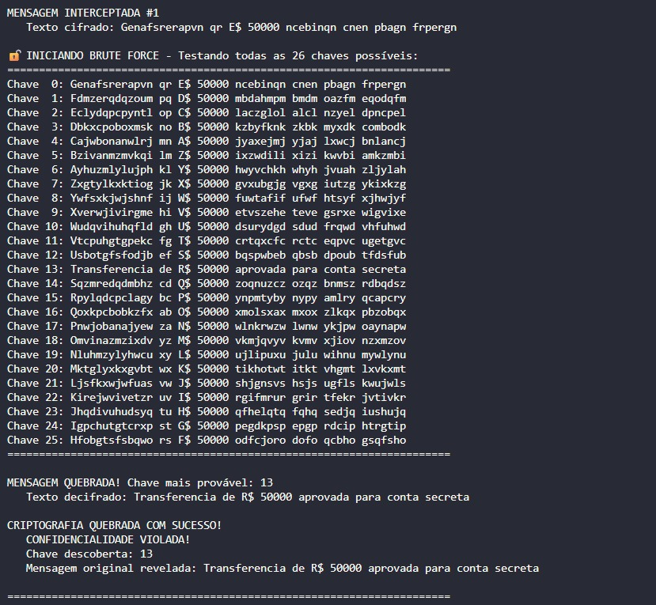
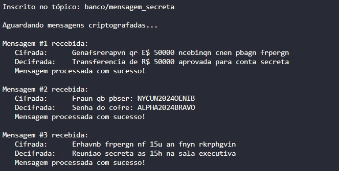

# Demonstração Visual no Frontend

Ao rodar o frontend deste projeto, você pode visualizar demonstrações interativas dos ataques (integridade, confidencialidade e disponibilidade).

Essa visualização facilita o entendimento prático dos cenários descritos abaixo.

# Simulação de ataques MQTT

Este repositório consolida dois cenários simples que ilustram como um invasor pode comprometer **integridade** e **confidencialidade** em mensagens trafegando por um broker MQTT local.

## Estrutura

- `integridade/` – fluxo publisher/attacker/subscriber no qual o atacante se posiciona como *man-in-the-middle*, altera o campo `para` e redireciona as transações para outro tópico.
- `confidencialidade/` – fluxo publisher/subscriber usando Cifra de César (ROT13) e um atacante que intercepta e faz *brute force* para quebrar a mensagem confidencial.
- `disponibilidade/` – fluxo publisher/attacker/subscriber no qual o atacante realiza um flood de mensagens para o mesmo tópico e degrada o recebimento dos heartbeats.

Cada pasta contém três scripts independentes (`publisher*.py`, `attacker*.py`, `subscriber*.py`) prontos para serem executados em terminais separados.

## Requisitos

- Python 3.11+ (ou equivalente disponível na máquina).
- Broker MQTT aceitando conexões em `localhost:1883` (ex.: Mosquitto).
- Dependências listadas em `requirements.txt` (`paho-mqtt`).

### Setup rápido

```powershell
python -m venv venv
.\venv\Scripts\activate
pip install -r requirements.txt
```


## Cenário 1 – Violação de integridade (MITM)

1. Abra três terminais e navegue para `integridade/`.
2. Terminal 1 – sistema legítimo:
   ```powershell
   python subscriber.py
   ```
3. Terminal 2 – atacante MITM:
   ```powershell
   python attacker.py
   ```
4. Terminal 3 – banco publicador:
   ```powershell
   python publisher.py
   ```

### Resultado esperado

O atacante lê `banco/transferencia`, sobrescreve o destinatário para “Conta do Hacker” e publica a mensagem adulterada em `banco/transferencia_real`. O subscriber legítimo, que confia apenas no tópico adulterado, processa transações já manipuladas, evidenciando a quebra de integridade.

## Cenário 2 – Violação de confidencialidade (Cifra de César)

1. Abra três terminais e navegue para `confidencialidade/`.
2. Terminal 1 – banco receptor:
   ```powershell
   python subscriber_cesar.py
   ```
3. Terminal 2 – atacante criptoanalista:
   ```powershell
   python attacker_cesar.py
   ```
4. Terminal 3 – banco emissor de mensagens cifradas:
   ```powershell
   python publisher_cesar.py
   ```

### Resultado esperado

O publisher envia mensagens sensíveis cifradas com ROT13 no tópico `banco/mensagem_secreta`. O attacker intercepta cada publicação, executa *brute force* das 26 chaves possíveis da Cifra de César e identifica automaticamente a chave correta usando palavras-chave financeiras. Com a chave recuperada, ele revela o conteúdo das mensagens, demonstrando a perda total de confidencialidade.

## Cenário 3 – Ataque à disponibilidade (Flood / DoS)

1. Abra três terminais e navegue para `disponibilidade/`.
2. Terminal 1 – monitor legítimo:
   ```powershell
   python subscriber.py
   ```
3. Terminal 2 – atacante flooder:
   ```powershell
   python attacker.py
   ```
4. Terminal 3 – publisher de heartbeats:
   ```powershell
   python publisher.py
   ```

### Resultado esperado

O publisher envia heartbeats sequenciais que o monitor usa para medir latência e quedas. O atacante publica centenas de mensagens por segundo com payload grande no mesmo tópico `banco/disponibilidade/status`, forçando o broker e o subscriber a tratar ruído constante. O monitor imprime alertas quando detecta heartbeats atrasados ou sequências quebradas, simulando a indisponibilidade causada pelo DoS.

---

Esses dois exemplos podem ser combinados ou estendidos para explorar conceitos de CIA triad (Confidentiality, Integrity, Availability) em ambientes MQTT e reforçar boas práticas de proteção (TLS, autenticação por certificado, tópicos segregados, payload criptografado robusto, etc.).

# Documentação: Ataque à Integridade (Man-in-the-Middle)

## Motivação do Atacante
O atacante busca modificar transações financeiras em trânsito para desviar valores para sua própria conta sem ser detectado. Diferentemente de um roubo direto, este ataque é mais sofisticado pois:

- Não bloqueia a comunicação (evita suspeitas)
- Mantém o fluxo aparentemente normal entre banco emissor e receptor
- Lucra silenciosamente alterando destinos e valores
- Explora a confiança que as partes têm na infraestrutura

## Cenário Real de Ataque
O atacante utiliza engenharia social para enganar ambas as partes:

Convence o Publisher (Banco Emissor):

```
"Nosso novo sistema de segurança requer que você publique no tópico banco/transferencia para auditoria"
```

O banco emissor acredita estar seguindo um protocolo legítimo.

Convence o Subscriber (Banco Receptor):

```
"Por questões de compliance, agora você deve escutar o tópico banco/transferencia_real onde chegam as transações validadas"
```

O banco receptor acredita estar conectado ao canal oficial.

O Atacante no Meio:

- Se inscreve em `banco/transferencia` (intercepta)
- Modifica as mensagens
- Republica em `banco/transferencia_real` (injeta mensagens adulteradas)

Resultado: Ambas as partes acreditam estar conectadas corretamente, mas o atacante está no meio manipulando tudo!

##  Impactos na Tríade CID
**C - Confidencialidade: Comprometida Parcialmente**

- Senhas expostas: O atacante vê todas as senhas em texto claro
- Dados sensíveis visíveis: Nomes, valores, contas bancárias
- Impacto: Médio - informações confidenciais são vazadas

**I - Integridade: SEVERAMENTE COMPROMETIDA**

- Dados adulterados: Valores e destinatários são alterados arbitrariamente
- Sem detecção: Nenhuma das partes percebe a modificação
- Impacto: CRÍTICO - Este é o principal objetivo do ataque

Consequências:

- Dinheiro desviado para contas erradas
- Prejuízo financeiro direto
- Perda de confiança no sistema

**D - Disponibilidade:  Não Afetada**

- O sistema continua operacional
- Mensagens chegam normalmente (mesmo que adulteradas)
- Não há negação de serviço

## Resumo do Impacto
Confidencialidade: ████░░░░░░ 40% comprometida

Integridade:       ██████████ 100% comprometida ⚠️ CRÍTICO

Disponibilidade:   ░░░░░░░░░░ 0% afetada

## Vulnerabilidade Explorada
1. Ausência de Autenticação de Mensagens

```python
# VULNERÁVEL: Sem verificação de origem
dados = json.loads(payload)  # Aceita qualquer JSON recebido
print(f"Processando: {dados}")  # Sem validar DE ONDE veio
```

Problema: O subscriber não tem como verificar se a mensagem realmente veio do publisher legítimo.

2. Falta de Verificação de Integridade

```python
# VULNERÁVEL: Sem assinatura digital
payload = json.dumps(transferencia)
client.publish(TOPIC, payload)  # Envia sem "selo de autenticidade"
```

**Problema:** Não há mecanismo para detectar se a mensagem foi alterada no caminho.

## 3. Arquitetura de Dois Tópicos Sem Validação

Publisher → [banco/transferencia] → ATACANTE → [banco/transferencia_real] → Subscriber

          ✅ Acredita publicar      🏴‍☠️           ✅ Acredita receber
          no canal correto        MODIFICA        do canal correto

Problema: Ambas as partes confiam cegamente nos nomes dos tópicos, facilitados por engenharia social.

4. Dados Sensíveis em Texto Claro

```python
{"de": "Gabriel", "para": "Paula", "valor": 5000, "senha": "senha123"}
```

Problema: Além de alterar, o atacante também consegue LER todos os dados, incluindo senhas.

5. Protocolo MQTT Sem TLS

```python
client.connect("localhost", 1883)  # Porta não-criptografada
```

Problema: Tráfego em texto claro permite interceptação fácil na rede.

Contramedida: Assinatura Digital (HMAC-SHA256)

Como Funciona

```python
# 1. Publisher gera assinatura
mensagem = json.dumps(dados)
assinatura = hmac.new(CHAVE_SECRETA, mensagem.encode(), hashlib.sha256).hexdigest()

# 2. Envia mensagem + assinatura
payload = {"dados": dados, "assinatura": assinatura}

# 3. Subscriber verifica ANTES de processar
if verificar_assinatura(mensagem, assinatura_recebida, CHAVE_SECRETA):
   processar()  # ✅ Íntegra
else:
   rejeitar()   # ❌ Adulterada
```

## Por Que o Ataque Falha

1. **Modificação Detectada:** Qualquer alteração nos dados torna a assinatura inválida
2. **Impossível Forjar:** Sem a chave secreta, o atacante não consegue gerar assinaturas válidas
3. **Proteção Matemática:** HMAC-SHA256 é criptograficamente seguro

**Resultado:** O subscriber **REJEITA** mensagens adulteradas! 🛡️

---

# Documentação: Ataque à Confidencialidade (Brute Force)

## Motivação do Atacante

O atacante busca **ler mensagens confidenciais** protegidas por criptografia fraca. Suas motivações incluem:

- **Espionagem Corporativa:** Obter informações privilegiadas (senhas de cofres, valores de transferências)
- **Vantagem Competitiva:** Conhecer estratégias e reuniões secretas
- **Roubo de Credenciais:** Capturar senhas para acessos futuros
- **Chantagem:** Usar informações confidenciais como moeda de troca

## Contexto do Ataque

O atacante **conhece o domínio alvo** (sistema bancário), o que lhe dá uma vantagem crucial:

- **Sabe o vocabulário usado:** termos como "transferência", "senha", "cofre", "reunião"
- **Possui dicionários especializados:** listas de palavras do setor financeiro
- **Pode aplicar heurísticas:** se um texto decifrado contém "R$" e "conta", provavelmente é válido
- **Entende o formato:** JSON com campos específicos do domínio bancário

Esta **inteligência contextual** torna o ataque muito mais eficaz que um brute force cego!

---

## Impactos na Tríade CID

### **C - Confidencialidade:** 🚨 SEVERAMENTE COMPROMETIDA
- **Mensagens secretas expostas:** Todas as comunicações cifradas são quebradas
- **Senhas reveladas:** Credenciais de cofres e sistemas
- **Informações estratégicas vazadas:** Reuniões, valores, planos
- **Impacto:** **CRÍTICO** - Este é o principal objetivo do ataque
- **Consequências:**
  - Perda de segredo comercial
  - Roubo de identidade
  - Fraudes futuras com credenciais roubadas
  - Dano reputacional severo

### **I - Integridade:** ✅ Não Afetada
- O atacante apenas LÊ, não modifica
- As mensagens chegam intactas ao destinatário
- Impacto: Nulo direto (mas informações roubadas podem ser usadas depois)

### **D - Disponibilidade:** ✅ Não Afetada
- Sistema continua operacional
- Não há interrupção de serviço
- Comunicação flui normalmente

### 📊 Resumo do Impacto

Confidencialidade: ██████████ 100% comprometida ⚠️ CRÍTICO
Integridade:       ░░░░░░░░░░ 0% afetada
Disponibilidade:   ░░░░░░░░░░ 0% afetada

🔓 Vulnerabilidade Explorada
### 1. Criptografia Extremamente Fraca (Cifra de César)

```python
# VULNERÁVEL: Apenas 26 chaves possíveis!
def cifra_cesar(texto, chave):
   # Rotação simples de letras
   return rotacionar(texto, chave)  # chave entre 0-25
```

**Problema:** Com apenas 26 possibilidades, um atacante pode testar TODAS em milissegundos.

### 2. Espaço de Chaves Minúsculo

Cifra de César:  26 chaves (2^4.7 bits)
AES-256:         2^256 chaves
             = 115.792.089.237.316.195.423.570.985.008.687.907.853.269.984.665.640.564.039.457.584.007.913.129.639.936

Diferença: AES-256 tem 4,46 × 10^75 VEZES mais chaves!
Problema: Brute force é trivialmente fácil com tão poucas opções.

### 3. Ataque Facilitado por Conhecimento de Domínio
O atacante tem uma lista especializada de 120+ palavras do contexto bancário:

```python
palavras_comuns = [
   # Contexto financeiro
   'transferencia', 'senha', 'cofre', 'conta', 'banco',
   'aprovada', 'saldo', 'deposito', 'pix', 'credito',
    
   # Segurança
   'confidencial', 'secreta', 'privada', 'token',
    
   # Valores
   'reais', 'valor', 'quantia', 'juros',
   # ... 100+ outras palavras
]
```

Como Funciona:

```python
# Para cada uma das 26 chaves possíveis:
for chave in range(26):
   texto_teste = decifrar(mensagem_cifrada, chave)
    
   # Se contém palavras bancárias, ENCONTROU!
   if 'transferencia' in texto_teste.lower():
      print(f"🎯 QUEBRADO! Chave: {chave}")
      return texto_teste
```

Problema: Heurística baseada em domínio aumenta drasticamente a taxa de sucesso.
### 4. Ausência de Sal ou IV (Initialization Vector)

```python
# Sempre produz o mesmo resultado
cifra_cesar("senha123", 13)  # Sempre: "fraqn123"
cifra_cesar("senha123", 13)  # Sempre: "fraqn123"
```

Problema: Padrões se repetem, facilitando análise de frequência.
### 5. Sem Proteção Contra Análise de Frequência

Problema: Um atacante experiente quebraria até sem brute force!

Contramedida: Criptografia Forte (AES-256)

Como Funciona

```python
# 1. Gera chave criptográfica forte de senha
kdf = PBKDF2(algorithm=hashes.SHA256(), length=32, salt=..., iterations=100000)
chave_aes = kdf.derive(senha.encode())

# 2. Criptografa com AES-256
fernet = Fernet(chave_aes)
mensagem_cifrada = fernet.encrypt(mensagem.encode())

# 3. Descriptografa (apenas quem tem a senha)
mensagem_original = fernet.decrypt(mensagem_cifrada)
```

### Por Que o Ataque Falha

1. **Espaço de Chaves Astronômico:**

   2^256 = 115.792.089.237.316.195.423.570.985.008.687.907.853.269.984.665.640.564.039.457.584.007.913.129.639.936
   
   Tempo para quebrar (1 bilhão de tentativas/segundo):
   = 3,67 × 10^51 anos
   
   Idade do universo: 1,38 × 10^10 anos
   = 2,66 × 10^41 vezes a idade do universo! 🤯

PBKDF2 Dificulta Ataques de Dicionário:

- 100.000 iterações tornam cada tentativa lenta
- Mesmo com lista de senhas comuns, o ataque leva séculos


Sem Padrões Reconhecíveis:

- Saída parece completamente aleatória
- Heurística de palavras comuns não funciona
- Análise de frequência é inútil

Matematicamente Seguro:

- AES-256 é padrão internacional (NIST)
- Usado por governos e bancos mundialmente
- Sem vulnerabilidades conhecidas


Resultado: O atacante FALHA COMPLETAMENTE em quebrar! 

---

## Imagem: Demonstração do Ataque








*Figura: Demonstração do ataque*