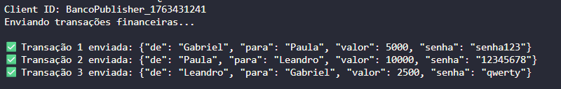
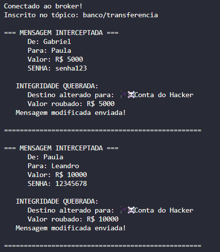
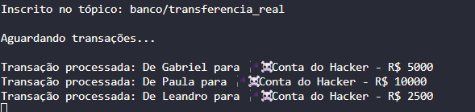

# Simulação de ataques MQTT

Este repositório consolida três cenários simples que ilustram como um invasor pode comprometer a **disponibilidade**, **integridade** e **confidencialidade** em mensagens trafegando por um broker MQTT local.

## Frontend (como rodar)

O repositório inclui um frontend estático (`index.html`) que simula visualmente os três cenários (sem enviar nada ao broker real). Há três formas simples de abrir:

- Abrir diretamente no navegador (rápido):
   - Dê duplo clique em `index.html` ou abra via “Abrir com…” no Chrome/Edge/Firefox.

- Servir com HTTP local (recomendado):
   - No PowerShell, na raiz do projeto:
      ```powershell
      cd C:\Users\Inteli\Documents\GitHub\simulacao-ataque
      python -m http.server 5500
      ```
   - Acesse: http://localhost:5500/index.html

- VS Code – Live Server (opcional):
   - Instale a extensão “Live Server”, abra `index.html` e clique em “Go Live”.

O que você verá: três cartões com botões de “Iniciar simulação” mostrando, passo a passo, os fluxos de Publisher, Attacker e Subscriber para Integridade, Confidencialidade e Disponibilidade. Use isso como apoio visual enquanto executa os scripts Python descritos abaixo.

## Sumário

- [Frontend (como rodar)](#frontend-como-rodar)
- [Estrutura](#estrutura)
- [Requisitos](#requisitos)
- [Setup rápido](#setup-rápido)
- [Cenários](#cenários)
- [Cenário 1 – Violação de integridade](#cenário-1--violação-de-integridade)
- [Cenário 2 – Violação de confidencialidade (Cifra de César)](#cenário-2--violação-de-confidencialidade-cifra-de-césar)
- [Cenário 3 – Ataque à disponibilidade (Flood / DoS)](#cenário-3--ataque-à-disponibilidade-flood--dos)
- [Detalhes: Integridade](#detalhes-integridade)
- [Detalhes: Confidencialidade](#detalhes-confidencialidade)
- [Detalhes: Disponibilidade](#detalhes-disponibilidade)
## Estrutura

- `integridade/` – fluxo publisher/attacker/subscriber no qual o atacante se posiciona como *man-in-the-middle*, altera o campo `para` e redireciona as transações para outra conta.
- `confidencialidade/` – fluxo publisher/subscriber usando Cifra de César (ROT13) e um atacante que intercepta e faz utiliza a força bruta para quebrar a mensagem confidencial.
- `disponibilidade/` – fluxo publisher/attacker/subscriber no qual o atacante realiza um flood de mensagens para o mesmo tópico e degrada o recebimento dos heartbeats.

Cada pasta contém três scripts independentes (`publisher*.py`, `attacker*.py`, `subscriber*.py`) prontos para serem executados em terminais separados.

## Requisitos

- Python 3.11+ (ou equivalente disponível na máquina).
- Broker MQTT aceitando conexões em `localhost:1883` (ex.: Mosquitto).
- Dependências listadas em `requirements.txt` (`paho-mqtt` e `cryptography`).

## Setup rápido

```powershell
python -m venv venv
.\venv\Scripts\activate
pip install -r requirements.txt
```

 
## Cenários

### Cenário 1 – Violação de integridade

1. Abra três terminais e navegue para `integridade/`.
2. Terminal 1 – sistema legítimo:
   ```powershell
   python subscriber.py
   ```
3. Terminal 2 – atacante MITM:
   ```powershell
   python attacker.py
   ```
4. Terminal 3 – banco publicador:
   ```powershell
   python publisher.py
   ```

#### Resultado esperado (Integridade)

O atacante lê `banco/transferencia`, sobrescreve o destinatário para “Conta do Hacker” e publica a mensagem adulterada em `banco/transferencia_real`. O subscriber legítimo, que confia apenas no tópico adulterado, processa transações já manipuladas, evidenciando a quebra de integridade.

### Cenário 2 – Violação de confidencialidade (Cifra de César)

1. Abra três terminais e navegue para `confidencialidade/`.
2. Terminal 1 – banco receptor:
   ```powershell
   python subscriber_cesar.py
   ```
3. Terminal 2 – atacante criptoanalista:
   ```powershell
   python attacker_cesar.py
   ```
4. Terminal 3 – banco emissor de mensagens cifradas:
   ```powershell
   python publisher_cesar.py
   ```

#### Resultado esperado (Confidencialidade)

O publisher envia mensagens sensíveis cifradas com ROT13 no tópico `banco/mensagem_secreta`. O attacker intercepta cada publicação, executa *brute force* das 26 chaves possíveis da Cifra de César e identifica automaticamente a chave correta usando palavras-chave financeiras. Com a chave recuperada, ele revela o conteúdo das mensagens, demonstrando a perda total de confidencialidade.

### Cenário 3 – Ataque à disponibilidade (Flood / DoS)

1. Abra três terminais e navegue para `disponibilidade/`.
2. Terminal 1 – monitor legítimo:
   ```powershell
   python subscriber.py
   ```
3. Terminal 2 – atacante flooder:
   ```powershell
   python attacker.py
   ```
4. Terminal 3 – publisher de heartbeats:
   ```powershell
   python publisher.py
   ```

#### Resultado esperado (Disponibilidade)

O publisher envia heartbeats sequenciais que o monitor usa para medir latência e quedas. O atacante publica centenas de mensagens por segundo com payload grande no mesmo tópico `banco/disponibilidade/status`, forçando o broker e o subscriber a tratar ruído constante. O monitor imprime alertas quando detecta heartbeats atrasados ou sequências quebradas, simulando a indisponibilidade causada pelo DoS.

---

## Detalhes: Integridade

## Motivação do Atacante
O atacante busca modificar transações financeiras em trânsito para desviar valores para sua própria conta sem ser detectado. Diferentemente de um roubo direto, este ataque é mais sofisticado pois:

- Não bloqueia a comunicação (evita suspeitas)
- Mantém o fluxo aparentemente normal entre banco emissor e receptor
- Lucra silenciosamente alterando destinos e valores
- Explora a confiança que as partes têm na infraestrutura

## Cenário Real de Ataque
Esta arquitetura de dois tópicos é estabelecida via engenharia social: o atacante manipula o publisher para publicar em um tópico e o subscriber para escutar outro, posicionando-se no meio sem levantar suspeitas. Ambas as partes acreditam estar conectadas diretamente, quando há um intermediário malicioso adulterando os dados. O subscriber legítimo, confiando no tópico adulterado, processa transações já manipuladas, evidenciando a quebra de integridade.

Assim, nessa simulação envolvendo transferências bancárias, o atacante no meio (man-in-the-middle):
- Se inscreve em `banco/transferencia` (intercepta)
- Modifica o destinatário da transferência
- Republica em `banco/transferencia_real` (injeta mensagens adulteradas)

Resultado: Ambas as partes acreditam estar conectadas corretamente, mas o atacante está no meio manipulando tudo!

##  Impactos na Tríade CID
**C - Confidencialidade: Comprometida Parcialmente**

- Senhas expostas: O atacante vê todas as senhas em texto claro
- Dados sensíveis visíveis: Nomes, valores, contas bancárias
- Impacto: Informações confidenciais são vazadas

**I - Integridade: SEVERAMENTE COMPROMETIDA**

- Dados adulterados: Valores e destinatários são alterados arbitrariamente
- Sem detecção: Nenhuma das partes percebe a modificação
- Impacto: Crítico, já que este é o principal objetivo do ataque

Consequências:
- Dinheiro desviado para contas erradas
- Prejuízo financeiro direto
- Perda de confiança no sistema

**D - Disponibilidade:  Não Afetada**
- O sistema continua operacional
- Mensagens chegam normalmente (mesmo que adulteradas)
- Não há negação de serviço

## Vulnerabilidade Explorada
### 1.  Ausência de Autenticação de Mensagens

O subscriber aceita e processa qualquer mensagem recebida no tópico subscrito sem validar sua origem ou autenticidade. Não há mecanismo para verificar se a mensagem foi efetivamente enviada pelo publisher legítimo ou por um agente malicioso.

Sem autenticação, qualquer entidade com acesso ao broker pode publicar mensagens falsas ou adulteradas que serão processadas como legítimas.

### 2. Falta de Verificação de Integridade
As mensagens são enviadas sem nenhum mecanismo criptográfico que garanta sua integridade. Não há assinatura digital, hash ou checksum que permita ao receptor detectar modificações nos dados durante o trânsito.

Assim, mensagens podem ser interceptadas e alteradas sem que o destinatário tenha qualquer forma de detectar a adulteração, comprometendo a confiabilidade dos dados recebidos.

### 3. Dados Sensíveis em Texto Claro

Informações confidenciais são transmitidas sem criptografia, tornando-as completamente visíveis para qualquer interceptador que tenha acesso ao tráfego de rede ou ao broker MQTT. 

### 5. Protocolo MQTT Sem TLS
A comunicação utiliza a porta padrão não-criptografada do MQTT (1883), transmitindo todo o tráfego em texto claro pela rede. Sem a Transport Layer Security (TLS), o tráfego pode ser facilmente interceptado através de ataques de sniffing de rede, expondo tanto o conteúdo das mensagens quanto metadados da comunicação.

## Imagem: Demonstração do Ataque
Publisher envia mensagens de transferência no tópico `banco/transferencia`.


O attacker intercepta cada publicação, altera o campo `para` para "Conta do Hacker" e publica a mensagem modificada em `banco/transferencia_real`.


O subscriber legítimo, que confia apenas no tópico adulterado, processa transações já manipuladas, evidenciando a quebra de integridade.


## Contramedida
Uma contramedida que pode ser utilizada é o HMAC-SHA256 para garantir a integridade das mensagens: o publisher serializa os dados em JSON e aplica a função HMAC com uma chave secreta compartilhada, gerando um hash hexadecimal único que funciona como "impressão digital" da mensagem, enviando tanto os dados quanto a assinatura em um payload estruturado. O subscriber recalcula a assinatura usando os mesmos dados e a chave secreta: se as assinaturas forem idênticas, a mensagem é processada, caso contrário é rejeitada automaticamente. O ataque falha porque o atacante, sem acesso à chave secreta compartilhada, não consegue gerar uma assinatura válida para dados adulterados, fazendo com que o subscriber detecte e bloqueie imediatamente a tentativa de fraude.

---

## Detalhes: Confidencialidade

## Motivação do Atacante

O atacante busca ler mensagens confidenciais protegidas por criptografia fraca. Suas motivações incluem:

- **Espionagem Corporativa:** Obter informações privilegiadas
- **Vantagem Competitiva:** Conhecer estratégias internas
- **Roubo de Credenciais:** Capturar senhas para acessos futuros
- **Chantagem:** Usar informações confidenciais como moeda de troca

## Contexto do Ataque Simulado

O atacante conhece o domínio alvo (sistema bancário), o que lhe dá uma vantagem crucial, já que pode utilizar termos comuns no setor financeiro, como "transferência", "senha", "cofre", "reunião", para aplicação de heurísticas.

## Impactos na Tríade CID

### C - Confidencialidade
- **Mensagens protegidas expostas:** Todas as comunicações cifradas são quebradas e seu conteúdo revelado
- **Credenciais reveladas:** Senhas e tokens de autenticação ficam visíveis ao atacante
- **Informações sensíveis vazadas:** Dados estratégicos, financeiros e operacionais são comprometidos
- **Impacto:** Crítico, já que esse é o principal objetivo do ataque
- **Consequências:**
  - Perda de sigilo de informações confidenciais
  - Possibilidade de roubo de identidade e credenciais
  - Exposição a fraudes futuras utilizando dados capturados
  - Dano reputacional e perda de confiança

### I - Integridade
- O atacante apenas intercepta e lê as mensagens, sem modificá-las
- As mensagens chegam intactas ao destinatário legítimo
- Impacto direto: Nulo, porém, as informações roubadas podem ser usadas posteriormente para outros ataques

### D - Disponibilidade
- Sistema continua operacional
- Não há interrupção de serviço
- Comunicação flui normalmente

## Vulnerabilidades Exploradas

### 1. Criptografia Extremamente Fraca (Cifra de César)
A Cifra de César utiliza apenas rotação alfabética simples, oferecendo um espaço de chaves de apenas 26 possibilidades (chaves de 0 a 25).

**Problema:** Com um conjunto tão reduzido de chaves possíveis, um atacante pode testar todas as combinações em milissegundos através de um ataque de força bruta.

### 2. Espaço de Chaves Minúsculo

Com um espaço de chaves tão limitado, ataques de força bruta tornam-se trivialmente fáceis e rápidos. Abaixo está uma comparação de complexidade:

**Cifra de César:** 26 chaves possíveis (aproximadamente 2^4.7 bits)
**AES-256:** 2^256 chaves possíveis (mais de 10^77 combinações)

É perceptível que o AES-256 possui aproximadamente 4,46 × 10^75 vezes mais chaves que a Cifra de César. Isso torna o AES-256 praticamente invulnerável a ataques de força bruta com a tecnologia atual.

### 3. Ataque Facilitado por Conhecimento de Domínio
A heurística baseada em contexto transforma um ataque cego em um ataque guiado, aumentando significativamente a eficácia. O atacante pode utilizar conhecimento do domínio da aplicação para aumentar drasticamente a taxa de sucesso do ataque. Ao possuir uma lista especializada de palavras relacionadas ao contexto, por exemplo, o atacante pode aplicar heurísticas para identificar qual das 26 tentativas de decodificação produziu o texto original.

**Funcionamento:** Para cada uma das 26 chaves possíveis, o atacante decodifica a mensagem e verifica se o texto resultante contém palavras esperadas do domínio. Quando palavras reconhecíveis aparecem, a chave correta foi encontrada.

### 4. Ausência de Sal ou IV (Initialization Vector)

A Cifra de César é determinística: a mesma entrada com a mesma chave sempre produz a mesma saída. A previsibilidade e repetição de padrões facilitam técnicas de criptoanálise estatística, permitindo que atacantes identifiquem padrões repetidos e utilizem análise de frequência.

```python
# Sempre produz o mesmo resultado
cifra_cesar("senha123", 13)
cifra_cesar("senha123", 13)
```

### 5. Sem Proteção Contra Análise de Frequência
Mesmo sem testar todas as chaves, técnicas de criptoanálise clássica podem quebrar a cifra rapidamente. A Cifra de César preserva características estruturais da língua original, como frequência de letras, tamanho de palavras e pontuação. Então, um atacante experiente pode explorar essas características sem necessidade de força bruta. 

---

## Imagem: Demonstração do Ataque

Publisher envia mensagens cifradas com Cifra de César (ROT13) no tópico `banco/mensagem_secreta`.


O attacker intercepta cada publicação, executa *brute force* das 26 chaves possíveis e identifica automaticamente a chave correta usando palavras-chave financeiras. Com a chave recuperada, ele revela o conteúdo das mensagens, demonstrando a perda total de confidencialidade.


O subscriber legítimo decifra as mensagens usando a chave conhecida (ROT13) e processa normalmente, sem imaginar que o atacante já leu tudo.


*Figuras: Demonstração do ataque*

## Contramedida
Uma possível contramedida, e que foi implementada na pasta `confidencialidade/contramedida`, implementa o padrão AES-256 (Advanced Encryption Standard com chave de 256 bits) utilizando a biblioteca Fernet. A chave criptográfica é derivada de uma senha compartilhada através do algoritmo PBKDF2 (Password-Based Key Derivation Function 2) com 100.000 iterações, tornando ataques de dicionário computacionalmente inviáveis.

O emissor deriva uma chave AES a partir de uma senha segura usando PBKDF2, criptografa a mensagem com AES-256 e envia o texto cifrado. O receptor, que possui a mesma senha, reconstrói a chave e descriptografa a mensagem.

O ataque falha porque o AES-256 oferece um espaço de chaves imenso (2^256 combinações), tornando ataques de força bruta impraticáveis. Além disso, o uso de PBKDF2 com múltiplas iterações dificulta ataques de dicionário, e a saída do AES-256 é indistinguível de dados aleatórios. A segurança matemática comprovada do AES-256, aprovado pelo NIST e amplamente utilizado por governos e instituições financeiras, garante que não existam vulnerabilidades conhecidas que permitam ataques práticos.

## Detalhes: Disponibilidade

## Motivação do Atacante
O atacante busca degradar ou interromper completamente o serviço através de sobrecarga de recursos, sem necessariamente roubar ou modificar dados. Suas motivações incluem:

- **Sabotagem Operacional:** Impedir que sistemas críticos funcionem adequadamente
- **Extorsão:** Ameaçar interromper serviços até receber pagamento
- **Vantagem Competitiva:** Prejudicar concorrentes durante períodos cruciais
- **Distração:** Desviar atenção da equipe de segurança enquanto executa outros ataques
- **Vandalismo Digital:** Demonstrar capacidade de causar danos sem motivação financeira

## Contexto do Ataque Simulado
Nesta simulação, o sistema legítimo envia heartbeats sequenciais a cada segundo para monitorar a saúde do serviço. O atacante explora a arquitetura publish-subscribe do MQTT para inundar o mesmo tópico com centenas de mensagens por segundo contendo payloads grandes, forçando o broker e o subscriber a processar volume massivo de dados irrelevantes.
O ataque funciona da seguinte forma:

1. O publisher legítimo envia heartbeats sequenciais no tópico banco/disponibilidade/status
2. O atacante publica 300 mensagens por segundo com payload de 4KB no mesmo tópico
3. O monitor (subscriber) tenta processar todas as mensagens, mas é sobrecarregado pelo flood
4. Resultado: Heartbeats legítimos chegam com atraso significativo ou são perdidos completamente

## Impactos na Tríade CID

### Confidencialidade

- O atacante não acessa ou expõe dados confidenciais
- As mensagens de flood não contêm informações sensíveis

**Impacto direto:** Nulo, porém, a indisponibilidade pode impedir sistemas de segurança de funcionar

### Integridade

- O atacante não modifica mensagens legítimas
- Dados que eventualmente chegam ao destino permanecem íntegros

**Impacto direto:** Nulo (mas a perda de mensagens pode causar inconsistências no sistema)

### Disponibilidade
- Degradação de Performance: Sistema operacional experimenta lentidão extrema
- Perda de Mensagens Críticas: Heartbeats legítimos são atrasados ou perdidos
- Sobrecarga de Recursos: Broker, rede e subscribers consomem CPU, memória e banda excessivamente

**Impacto Direto:** Crítico, já que esse é o principal objetivo do ataque

- Consequências:
  - Impossibilidade de monitorar estado real do sistema
  - Falha em detectar problemas operacionais genuínos
  - Timeout de conexões e falha em sistemas dependentes
  - Degradação da experiência do usuário
  - Potencial queda completa do serviço

## Vulnerabilidades Exploradas
### 1. Ausência de Limitação de Taxa (Rate Limiting)
O broker MQTT aceita e processa todas as mensagens recebidas sem impor limites sobre quantas mensagens um cliente pode publicar por segundo ou minuto.

Problema: Clientes maliciosos podem saturar o broker com volume arbitrário de mensagens, consumindo recursos indefinidamente e impedindo o processamento de tráfego legítimo.

### 2. Falta de Autenticação e Autorização
Qualquer cliente pode se conectar ao broker e publicar em qualquer tópico sem validação de identidade ou verificação de permissões.

Problema: Não há mecanismo para distinguir publishers legítimos de atacantes, permitindo que qualquer entidade execute flood attacks sem restrições.

### 3. Ausência de Validação de Tamanho de Payload
O broker aceita mensagens com payloads de tamanho arbitrário (neste caso, 4KB de dados aleatórios) sem validação ou limite máximo configurado.

Problema: Mensagens com payloads grandes consomem significativamente mais banda, memória e tempo de processamento, amplificando o impacto do ataque de negação de serviço.

### 4. Compartilhamento de Tópico Sem Segregação
Mensagens legítimas e maliciosas trafegam pelo mesmo tópico sem qualquer mecanismo de priorização ou segregação de tráfego.

Problema: O subscriber precisa processar todas as mensagens indiscriminadamente, impossibilitando-o de priorizar heartbeats críticos sobre ruído malicioso.

### 5. Falta de Detecção de Anomalias
O sistema não possui mecanismos automáticos para detectar padrões anômalos de tráfego, como picos súbitos de volume ou mensagens com características suspeitas (payloads aleatórios, frequência anormal).

Problema: O ataque pode continuar indefinidamente sem ser detectado ou mitigado automaticamente, maximizando o dano causado.